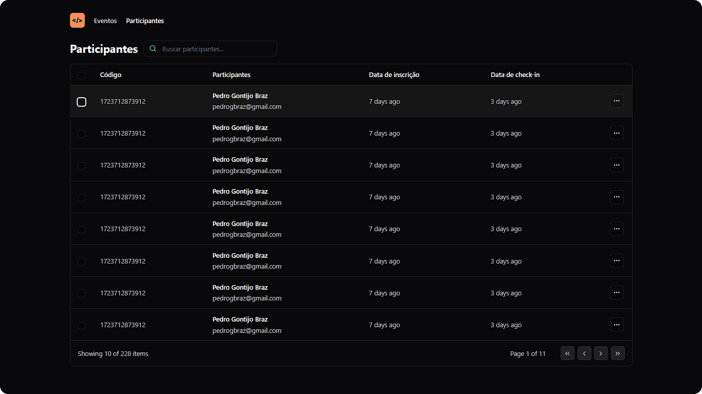

<h1 align="left"> Pass In Web </h1>

Pass in Web que fiz do zero conforme a aula do NLW da RocketSeat Trilha: Reactjs



---

## 🚀 Como visualizar

Execute este comando no seu terminal:

```
git clone https://github.com/pedrogbraz/pass-in-web
```

Mover para o diretório

```
cd ./pass-in-web-main
```

Instale o projeto com

```
npm install
```

E, finalmente, execute o comando:

```
npm run dev
```

O projeto será localizado em: `http://localhost:5173`

---

## 🚀 Tecnologias Usadas

- React
- Tailwind css
- TypeScript
- Git e Github

O projeto foi feito no Visual Studio Code.
